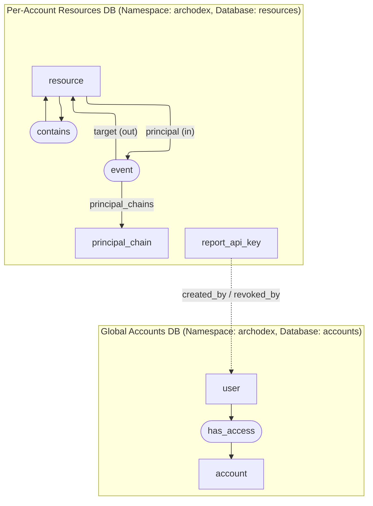

# Archodex Data Model

The Archodex backend stores tenant membership and observed platform telemetry across two SurrealDB databases: a shared `accounts` database and per-account `resources` databases. This document describes the schema, relationships, and ingestion behaviors for these databases.

## Database Topology

*Dotted arrow indicates a record ID stored in the resources DB that references a `user` record housed in the accounts DB.*

## Accounts Database

- **SurrealDB Namespace:** `archodex`
- **SurrealDB Database:** `accounts`

The accounts database centralizes tenant provisioning and user-to-account access. The `Account` model supplies the connection details for each tenant's resources database.

### Record Table: `account`

This table exists in both the global archodex.com environment and in self-hosted backend environments.

Account IDs are globally unique, even among self-hosted instances. When an account is self-hosted, the global archodex.com database account record contains only the information necessary to point the Archodex Dashboard to the self-hosted instance endpoint. The self-hosted environment contains the full account record in its database.

| Field | Type | Assertions | Populated in global `account` table for managed accounts? | Populated in global `account` table for self-hosted accounts? | Populated in self-hosted `account` tables? | Notes |
| --- | --- | --- | --- | --- | --- | --- |
| `id` | string | 10-digit numeric string, no leading zeros (i.e. >= `1000000000`) | ✅ | ✅ | ✅ | |
| `endpoint` | string | Must be a valid URL | ✅ | ✅ | ✅ | API URL for this account. |
| `service_data_surrealdb_url` | string | | ✅ | ❌ | ❌ | Connection string for the tenant's *resources* SurrealDB database store. |
| `salt` | bytes | 16-byte length | ✅ | ❌ | ✅ | Salt used by agents to cryptographically hash Secret Values before transmitting to the account backend. |
| `api_private_key` | bytes (optional) | 16-byte length | ❌ | ❌ | ✅ | Generated private key material for API keys in self-hosted instances when the account is created without a private key specified via the `ARCHODEX_API_PRIVATE_KEY` environment variable. |
| `created_at` | datetime | | ✅ | ✅ | ✅ | Account creation timestamp. |
| `created_by` | `user` record | | ✅ | ✅ | ✅ | User who created the account. |
| `deleted_at` | datetime (optional) | | ✅ | ✅ | ✅ | Account deletion timestamp. Used to check if the account is active. |
| `deleted_by` | `user` record (optional) | | ✅ | ✅ | ✅ | User who deleted the account. |

### Record Table: `user`

This table exists in both the global archodex.com environment and in self-hosted backend environments. The global archodex.com database will contain a record for every Archodex user, including users of self-hosted instances.

> [! NOTE]
> This table does not contain any PII or otherwise confidential information about users. User emails, the only user PII data stored by Archodex, are maintained in the global AWS Cognito User Pool.

| Field | Type | Notes |
| --- | --- | --- |
| `id` | uuid | AWS Cognito User ID. Matches the subject field of Archodex Dashboard JWT access tokens. |
| `created_at` | datetime | Defaults to `time::now()`. |

### Relation Table: `has_access`

This table exists in both the global archodex.com environment and in self-hosted backend environments. When a user authenticates in the Archodex Dashboard to the global archodex.com AWS Cognito User Pool, the user's ID is used to determine which Archodex accounts the user has access to. The global backend then returns the list of accounts along with their API endpoints.

If a user then accesses a self-hosted instance through its API endpoint, the self-hosted backend will also check the existence of this `has_access` relation in its database.

| Field | Type | Notes |
| --- | --- | --- |
| `in` | `user` record | User who has access. |
| `out` | `account` record | Archodex account the user may access. |
| `created_at` | datetime | Defaults to `time::now()`. |

## Resources Database

- **SurrealDB Namespace:** `a<account ID>` for global archodex.com environment, `archodex` for self-hosted environments
- **SurrealDB Database:** `resources`

The *resources* database is an isolated SurrealDB database for storing customer data. The connection URL is recorded on the corresponding `account` record (see above). The schema supports hierarchical resources and event provenance.

### Record Table: `resource`

| Field | Type | Notes |
| --- | --- | --- |
| `id` | array of array of pairs of strings | See below. |
| `resource_type` | string | The type of the resource, e.g. `DynamoDB Table` |
| `resource_id` | string | The unique identifier of the resource within the resource hierarchy, e.g. `items` for a DynamoDB Table inside a specific AWS Region/Account/Partition. |
| `environments` | set of strings | User-managed tags (e.g., `prod`, `staging`); defaults to `[]`. |
| `first_seen_at` | datetime | When Archodex first observed the resource. |
| `last_seen_at` | datetime | Updated whenever the resource is re-observed. |
| `attributes` | object | Flexible metadata captured from agents; defaults to `{}`. |

#### Resource IDs

- Resource IDs are an ordered array of pairs of strings: each part contains a `type` and an `id`. Example: `[['AWS Partition','aws'], ['Account','123456789012'], ['Region', 'us-east-1'], ['DynamoDB Table','items']]`.
- The top-level array establishes a hierarchy of resources, where later resources are considered to be *contained* by earlier resource IDs. In the above example, the DynamoDB Table is *contained* by the Region, which is *contained* by the Account, and so on.
- The `resource` table will contain records for all *resources* in the hierarchy. If the agent reports seeing the above DynamoDB Table, the following records will be upserted by the backend:
  - `resource:[['AWS Partition','aws']]`
  - `resource:[['AWS Partition','aws'], ['Account','123456789012']]`
  - `resource:[['AWS Partition','aws'], ['Account','123456789012'], ['Region', 'us-east-1']]`
  - `resource:[['AWS Partition','aws'], ['Account','123456789012'], ['Region', 'us-east-1'], ['DynamoDB Table','items']]`
- `resource_type` and `resource_id` are derived from the last segment of `id`.

### Relation Table: `contains`
Resource IDs encode their global hierarchy. However, some resources have globally unique identifiers that may be observed without their containing resource context.

Agent reports mark resources as `globally_unique` when the observed identifier is known to be globally scoped (e.g. an AWS S3 Bucket name). In that case the resource is recorded as though it is a root resource of a hiearchy of resources. When the true parent resource (e.g. the AWS Region/Account/Partition for an AWS S3 Bucket) is discovered the backend records a `contains` relation to stitch the hierarchy together.

| Field | Type | Notes |
| --- | --- | --- |
| `in` | `resource` record | Container resource. |
| `out` | `resource` record | Contained resource. |
| `first_seen_at` / `last_seen_at` | datetime | Observation window for the containment relationship. |

### Record Table: `principal_chain`
Archodex observes events as having a *Principal* resource that directly performs an action on a target resource. Further, the *Principal* resource that directly performed the action may also have been caused by preceding *Principal* resources. The following is an example of an event with multiple *Principal* resources:

1. User **Alice** *triggered* a GitHub Actions Workflow **workflow.yaml**
2. The workflow *created* an AWS S3 Bucket named **alice-bucket**

This observed event has a *Principal Chain* with two *Principal* resources: **Alice** -*triggered*-> **workflow.yaml**. We say that **workflow.yaml** *directly* performed the *created* action on **alice-bucket**, and that **Alice** *indirectly* performed the *created* action on **alice-bucket**.

Principal chains model the causal path from an initiating principal to additional principals observed during actions. We record unique *Principal Chains* in the `principal_chain` table to link them to the one or more events they performed on target resources.

| Field | Type | Notes |
| --- | --- | --- |
| `id` | array of pairs of *Resource IDs* and *actions* | Each item of the array has a the resource Id of a *Principal* resource and the *action* string. The *action* string describes what the previous *Principal* in the chain did to cause this *Principal* resource to be part of the chain. |
| `first_seen_at` / `last_seen_at` | datetime | Bounds when the chain was first/last observed. |

### Relation Table: `event`
`event` records are created for each *Principal* resource in the principal chain of an event. A link to the `principal_chain` records for all chains that ever caused this event between the *Principal* resource and the target resource is also maintained. This allows us to know whether a *Principal* has ever directly and/or indirectly performed an action on a target resource.

| Field | Type | Notes |
| --- | --- | --- |
| `in` | `resource` record | *Principal* resource performing the action. |
| `out` | `resource` record | Target resource for the action. |
| `type` | string | Event action, as a past-tense verb (e.g., `created`, `rotated`). |
| `principal_chains` | set of `principal_chain` records | All unique principal chains that explain how this principal acted directly and/or indirectly on the target. |
| `has_direct_principal_chain` | bool | True if at least one referenced `principal_chain` represents this event record's *Principal* resource as the direct actor for this event (i.e., the terminal principal in the chain is the `in` resource). This flag is not currently used and may be removed in the future. |
| `first_seen_at` / `last_seen_at` | datetime | Observation window for this specific principal/target/type triple. |

### Record Table: `report_api_key`
Report API keys authenticate agents as they report observations to a backend instance. Validation checks both the encoded account ID and the key's revocation state.

| Field | Type | Notes |
| --- | --- | --- |
| `id` | int | Non-negative integer; generated as a random six-digit value when issued. Unique within an account. |
| `description` | option<string> | User-provided description. |
| `version` | int | Version of the API key protobuf definition. The only currently valid value is `1`. |
| `created_at` | datetime | Auto-populated. |
| `created_by` | `user` record link | Stores the record ID of the user who created the API key. Note that the `user` table does not exist in this `resources` database schema, but SurrealDB allows us to create record links anyways. Neither type nor validity checks are performed. This link is informational and is not used for any functionality. |
| `revoked_at` | datetime (optional) | Populated when revoked. |
| `revoked_by` | `user` record link (optional) | Record ID of the revoking user from the accounts DB. |

> [! NOTE]
> The `user` table does not exist in this `resources` database schema, but SurrealDB allows us to create record links anyways. Neither record ID type nor validity checks are performed. User links in this table are informational for auditing purposes but are not used for any functionality.

### SurrealDB Helper Functions

- `fn::fetch_global_containers(resources: set<record<resource>>)` recursively ascends containment chains to collect globally-unique ancestors for the set of resources involved in a query response. It is used by dashboard queries to provide the full resource hierarchy for resources with globally unique identifiers.

### Ingestion Workflow Highlights

1. **Resource captures** (`report.resource_captures`):
   - Upsert resources (preserving `first_seen_at`, updating `last_seen_at`).
   - Merge provided `attributes`.
   - Build or extend `contains` edges, respecting the single-parent constraint.

2. **Event captures** (`report.event_captures`):
   - Create or update `principal_chain` records from ordered principals; the optional `event` on each hop describes the action linking hop *n-1* to hop *n* (e.g., a container **read** a secret).
   - Insert `event` relations for every principal/target combination in each chain and event type, updating `last_seen_at`, aggregating `principal_chains`, and flagging `has_direct_principal_chain` when the terminal principal matches the `in` resource.