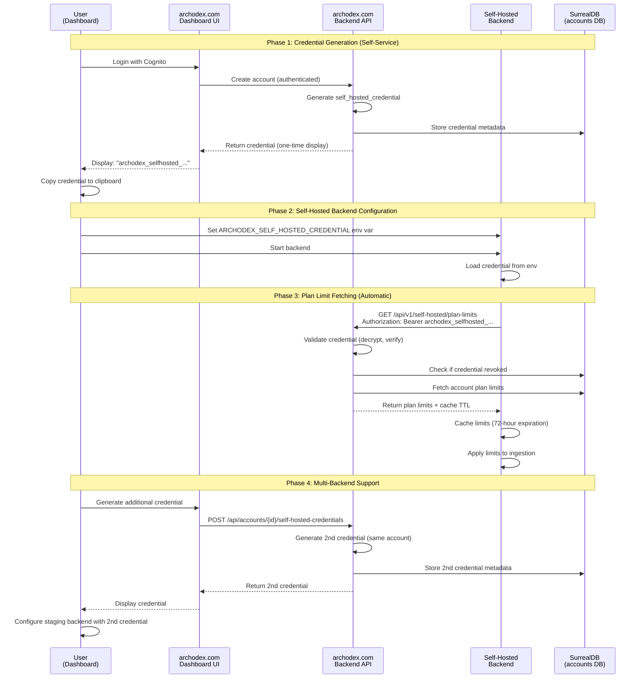

# Self-Service Authentication Flow for Self-Hosted Backends

**Feature**: Self-hosted backend authentication to fetch plan limits from archodex.com
**Date**: 2025-10-10
**Context**: Part of rate limiting feature (001-rate-limits-we)
**Related Docs**: [research.md](./research.md), [spec.md](./spec.md), [plan.md](./plan.md)

## Executive Summary

This document presents a detailed design for **self-service authentication** that allows self-hosted Archodex backends to securely fetch plan limits from archodex.com without requiring Archodex employee involvement in credential generation or management.

**Recommended Approach**: **Enhanced Shared Secret with AES-GCM Authenticated Encryption** (Option 3 Enhanced)

This approach balances security, operational simplicity, and multi-backend support while leveraging the existing proven architecture used for report API keys.

---

## Requirements Recap

### Critical Requirements
1. **Self-service**: No Archodex employee involvement in credential generation
2. **Multi-backend support**: Account can have multiple self-hosted backends (staging + production)
3. **Restart-safe**: Backend can restart and use same credential (no re-registration needed)
4. **Abuse-tolerant**: Some risk of abuse is acceptable (free tier users won't become paying customers anyway)

### Constraints
- Account creation happens via archodex.com dashboard (user authenticates with AWS Cognito)
- Self-hosted backends need to call archodex.com API to fetch plan limits
- Backend must prove it's authorized for a specific account
- Solution should align with existing authentication patterns in codebase

---

## Solution Overview: Enhanced Shared Secret

### Architecture Diagram



---

## Detailed Design

### 1. Credential Structure

#### Protobuf Definition

```protobuf
syntax = "proto3";

package archodex.self_hosted_credential;

// Self-hosted backend credential for fetching plan limits from archodex.com
message SelfHostedCredential {
  uint32 version = 1;  // Protocol version (currently 1)
  fixed64 account_id = 2;  // Archodex account ID
  bytes nonce = 3;  // AES-GCM nonce (12 bytes)
  bytes encrypted_contents = 4;  // Encrypted payload
}

// Encrypted using AES-GCM with account-specific key
message SelfHostedCredentialEncryptedContents {
  fixed64 account_id = 1;  // Account ID (redundant for validation)
  uint32 credential_id = 2;  // Random 6-digit ID (100000-999999)
  bytes secret_bytes = 3;  // Random 16 bytes for additional entropy
}

// Additional Authenticated Data (AAD) for AES-GCM
message SelfHostedCredentialAAD {
  fixed64 account_id = 1;
  string purpose = 2;  // Always "self-hosted-plan-fetch"
  uint32 credential_id = 3;
}
```

#### Credential Format

**String representation**: `archodex_selfhosted_{credential_id}_{base64_protobuf}`

**Example**: `archodex_selfhosted_123456_dGVzdGRhdGE=...`

**Design Rationale**:
- **Prefix** (`archodex_selfhosted_`): Clear identification, prevents accidental use as report API key
- **Credential ID in plaintext**: Enables quick lookup in database without decryption
- **Base64 protobuf**: Version-safe, extensible, compact representation
- **AES-GCM encryption**: Tamper-proof, authenticated, proven in existing report API key implementation

### 2. Database Schema

#### New Table: `self_hosted_credential`

```sql
-- In archodex.accounts database
DEFINE TABLE IF NOT EXISTS self_hosted_credential SCHEMAFULL TYPE NORMAL;

-- Fields
DEFINE FIELD IF NOT EXISTS account_id ON TABLE self_hosted_credential
    TYPE record<account> ASSERT $value != NONE;

DEFINE FIELD IF NOT EXISTS credential_id ON TABLE self_hosted_credential
    TYPE int ASSERT $value >= 100000 AND $value <= 999999;

DEFINE FIELD IF NOT EXISTS description ON TABLE self_hosted_credential
    TYPE option<string>;

DEFINE FIELD IF NOT EXISTS created_at ON TABLE self_hosted_credential
    TYPE datetime DEFAULT time::now();

DEFINE FIELD IF NOT EXISTS created_by ON TABLE self_hosted_credential
    TYPE record<user> ASSERT $value != NONE;

DEFINE FIELD IF NOT EXISTS last_used_at ON TABLE self_hosted_credential
    TYPE option<datetime>;

DEFINE FIELD IF NOT EXISTS revoked_at ON TABLE self_hosted_credential
    TYPE option<datetime>;

DEFINE FIELD IF NOT EXISTS revoked_by ON TABLE self_hosted_credential
    TYPE option<record<user>>;

-- Indexes
DEFINE INDEX IF NOT EXISTS credential_id_idx ON TABLE self_hosted_credential
    FIELDS credential_id UNIQUE;

DEFINE INDEX IF NOT EXISTS account_id_idx ON TABLE self_hosted_credential
    FIELDS account_id;
```

**Record ID Format**: `self_hosted_credential:{credential_id}` (e.g., `self_hosted_credential:123456`)

**Design Rationale**:
- **Credential ID as record ID**: O(1) lookups during validation
- **Account ID index**: Efficient listing of all credentials for an account
- **Revocation fields**: Instant invalidation without credential rotation
- **Last used tracking**: Audit trail for security monitoring
- **Created by user**: Ties credential to dashboard user for accountability

### 3. Credential Generation (Self-Service)

#### API Endpoint: `POST /api/accounts/{account_id}/self-hosted-credentials`

**Authentication**: AWS Cognito JWT (existing DashboardAuth middleware)

**Authorization**: User must have `has_access` relationship to account

**Request Body**:
```json
{
  "description": "Production backend" // Optional
}
```

**Response** (201 Created):
```json
{
  "credential_id": 123456,
  "credential_value": "archodex_selfhosted_123456_dGVzdGRhdGE=...",
  "description": "Production backend",
  "created_at": "2025-10-10T12:00:00Z",
  "account_id": "1234567890"
}
```

**Generation Algorithm**:

```rust
use aes_gcm::{Aes128Gcm, KeyInit, Aead, AeadCore};
use prost::Message;
use rand::Rng;
use base64::prelude::*;

#[instrument(err)]
pub async fn generate_self_hosted_credential(
    account_id: &str,
    description: Option<String>,
    created_by: &User,
) -> anyhow::Result<(u32, String)> {
    // 1. Generate random 6-digit credential ID
    let credential_id: u32 = rand::thread_rng().gen_range(100_000..=999_999);

    // 2. Prepare encrypted contents
    let contents = SelfHostedCredentialEncryptedContents {
        account_id: account_id.parse::<u64>()?,
        credential_id,
        secret_bytes: rand::thread_rng().gen::<[u8; 16]>().to_vec(),
    };

    // 3. Prepare AAD for authenticated encryption
    let aad = SelfHostedCredentialAAD {
        account_id: account_id.parse::<u64>()?,
        purpose: "self-hosted-plan-fetch".to_string(),
        credential_id,
    };

    // 4. Encrypt with AES-GCM
    let cipher = Aes128Gcm::new(api_private_key().await);
    let nonce = Aes128Gcm::generate_nonce(&mut rand::rngs::OsRng);

    let encrypted_contents = cipher.encrypt(
        &nonce,
        aead::Payload {
            msg: &contents.encode_to_vec(),
            aad: &aad.encode_to_vec(),
        },
    )?;

    // 5. Build protobuf structure
    let credential_proto = SelfHostedCredential {
        version: 1,
        account_id: account_id.parse::<u64>()?,
        nonce: nonce.as_slice().to_vec(),
        encrypted_contents,
    };

    // 6. Format as string
    let credential_value = format!(
        "archodex_selfhosted_{}_{}",
        credential_id,
        BASE64_STANDARD.encode(credential_proto.encode_to_vec())
    );

    // 7. Store metadata in database
    db.query("
        CREATE self_hosted_credential:{$credential_id} CONTENT {
            account_id: type::thing('account', $account_id),
            credential_id: $credential_id,
            description: $description,
            created_by: $created_by
        }
    ")
    .bind(("credential_id", credential_id))
    .bind(("account_id", account_id))
    .bind(("description", description))
    .bind(("created_by", surrealdb::sql::Thing::from(created_by)))
    .await?;

    Ok((credential_id, credential_value))
}
```

**Uniqueness Guarantee**: If credential_id collision occurs (1 in 900,000 chance), database unique index will fail the INSERT, and generation will be retried automatically.

### 4. Automatic Credential Generation on Account Creation

**When**: User creates a new account in dashboard

**What**: Automatically generate one self-hosted credential and display it once

**Why**: Zero-friction onboarding - user gets credential immediately without extra steps

**Implementation**:

```rust
// In src/accounts.rs::create_account()

#[instrument(err)]
pub async fn create_account(
    principal: &DashboardAuth,
    req: CreateAccountRequest,
) -> Result<CreateAccountResponse> {
    // ... existing account creation logic ...

    // Generate self-hosted credential automatically
    let (credential_id, credential_value) =
        generate_self_hosted_credential(
            &account.id(),
            Some("Default self-hosted credential".to_string()),
            principal.principal(),
        ).await?;

    Ok(CreateAccountResponse {
        account: AccountPublic::from(account),
        self_hosted_credential: Some(SelfHostedCredentialPublic {
            credential_id,
            credential_value, // Display once, never returned again
            description: Some("Default self-hosted credential".to_string()),
            created_at: chrono::Utc::now(),
        }),
    })
}
```

**Dashboard UI Flow**:
1. User fills out "Create Account" form
2. User clicks "Create"
3. Success page shows:
   - Account ID
   - **Self-hosted credential (one-time display)**
   - Copy button for credential
   - Warning: "Save this credential now. You won't be able to see it again."
4. User can generate additional credentials later via "Settings > Self-Hosted Credentials"

### 5. Credential Validation (Backend)

#### API Endpoint: `GET /api/v1/self-hosted/plan-limits`

**Authentication**: Self-hosted credential in `Authorization: Bearer {credential}` header

**Response** (200 OK):
```json
{
  "account_id": "1234567890",
  "plan": {
    "max_resources": 500,
    "max_events_per_hour": 1000,
    "update_frequency_seconds": 1200
  },
  "fetched_at": "2025-10-10T12:00:00Z",
  "cache_until": "2025-10-13T12:00:00Z"
}
```

**Validation Algorithm**:

```rust
#[instrument(err, skip_all, fields(credential_id))]
pub async fn validate_self_hosted_credential(
    credential_value: &str,
) -> anyhow::Result<String> {
    // 1. Parse credential format
    let Some(credential_value) = credential_value.strip_prefix("archodex_selfhosted_") else {
        bail!("Invalid credential: missing prefix");
    };

    let parts: Vec<&str> = credential_value.splitn(2, '_').collect();
    let [credential_id_str, base64_payload] = parts[..] else {
        bail!("Invalid credential: malformed format");
    };

    let credential_id: u32 = credential_id_str.parse()
        .context("Invalid credential: credential_id not a number")?;

    ensure!(
        (100_000..=999_999).contains(&credential_id),
        "Invalid credential: credential_id out of range"
    );

    tracing::Span::current().record("credential_id", credential_id);

    // 2. Decode protobuf
    let payload_bytes = BASE64_STANDARD.decode(base64_payload)
        .context("Invalid credential: base64 decode failed")?;

    let credential_proto = SelfHostedCredential::decode(payload_bytes.as_slice())
        .context("Invalid credential: protobuf decode failed")?;

    ensure!(
        credential_proto.version == 1,
        "Invalid credential: unsupported version"
    );

    let account_id = credential_proto.account_id.to_string();

    // 3. Decrypt encrypted contents
    let cipher = Aes128Gcm::new(api_private_key().await);
    let nonce = aead::Nonce::<Aes128Gcm>::from_slice(&credential_proto.nonce);

    let aad = SelfHostedCredentialAAD {
        account_id: credential_proto.account_id,
        purpose: "self-hosted-plan-fetch".to_string(),
        credential_id,
    };

    let decrypted_bytes = cipher.decrypt(
        nonce,
        aead::Payload {
            msg: &credential_proto.encrypted_contents,
            aad: &aad.encode_to_vec(),
        },
    ).map_err(|_| anyhow!("Invalid credential: decryption failed"))?;

    let contents = SelfHostedCredentialEncryptedContents::decode(
        decrypted_bytes.as_slice()
    ).context("Invalid credential: decrypted contents decode failed")?;

    // 4. Validate account_id matches
    ensure!(
        contents.account_id == credential_proto.account_id,
        "Invalid credential: account_id mismatch"
    );

    ensure!(
        contents.credential_id == credential_id,
        "Invalid credential: credential_id mismatch"
    );

    // 5. Check database for revocation status
    let db = accounts_db().await?;

    let credential_record: Option<SelfHostedCredentialRecord> = db
        .query("
            SELECT * FROM self_hosted_credential:$credential_id
            WHERE revoked_at IS NONE
        ")
        .bind(("credential_id", credential_id))
        .await?
        .take(0)?;

    let Some(record) = credential_record else {
        warn!(credential_id, "Credential not found or revoked");
        bail!("Invalid credential: not found or revoked");
    };

    // 6. Update last_used_at timestamp (fire-and-forget)
    tokio::spawn(async move {
        let _ = db.query("
            UPDATE self_hosted_credential:$credential_id
            SET last_used_at = time::now()
        ")
        .bind(("credential_id", credential_id))
        .await;
    });

    Ok(account_id)
}
```

**Security Properties**:
- **Tamper-proof**: Any modification to credential string causes decryption to fail
- **Account-bound**: Credential can only be used for the specific account it was issued for
- **Purpose-bound**: AAD includes "self-hosted-plan-fetch" to prevent reuse for other purposes
- **Instant revocation**: Database check prevents use of revoked credentials
- **Audit trail**: `last_used_at` tracking for security monitoring

### 6. Multi-Backend Support

**Scenario**: User has 3 self-hosted backends:
1. Development (local laptop)
2. Staging (cloud VM)
3. Production (cloud VM)

**Solution**: Generate 3 separate credentials

**Dashboard UI** ("Settings > Self-Hosted Credentials" page):

```
┌─────────────────────────────────────────────────────────────┐
│ Self-Hosted Credentials                                     │
├─────────────────────────────────────────────────────────────┤
│                                                             │
│ [+ Generate New Credential]                                 │
│                                                             │
│ ┌─────────────────────────────────────────────────────────┐ │
│ │ Credential: 123456                                      │ │
│ │ Description: Production backend                         │ │
│ │ Created: 2025-10-10 12:00:00 UTC                        │ │
│ │ Last used: 2025-10-10 14:23:15 UTC                      │ │
│ │                                   [Revoke] [Copy Value] │ │
│ └─────────────────────────────────────────────────────────┘ │
│                                                             │
│ ┌─────────────────────────────────────────────────────────┐ │
│ │ Credential: 234567                                      │ │
│ │ Description: Staging backend                            │ │
│ │ Created: 2025-10-10 13:00:00 UTC                        │ │
│ │ Last used: Never                                        │ │
│ │                                   [Revoke] [Copy Value] │ │
│ └─────────────────────────────────────────────────────────┘ │
│                                                             │
└─────────────────────────────────────────────────────────────┘
```

**Note**: "Copy Value" button re-displays the credential value by re-generating it from the database record (since we don't store the original string). This requires decrypting the metadata and re-encrypting with the same credential_id.

**Alternative**: Store credential value encrypted in database with a separate key. Trade-off: more complex, but avoids re-generation.

**Recommendation**: Do NOT support "Copy Value" - only show credential once during generation. This enforces security best practice (secrets shown once).

### 7. Credential Revocation

#### API Endpoint: `DELETE /api/accounts/{account_id}/self-hosted-credentials/{credential_id}`

**Authentication**: AWS Cognito JWT (existing DashboardAuth middleware)

**Authorization**: User must have `has_access` relationship to account

**Response** (204 No Content)

**Implementation**:

```rust
#[instrument(err)]
pub async fn revoke_self_hosted_credential(
    principal: &DashboardAuth,
    account_id: &str,
    credential_id: u32,
) -> Result<()> {
    let db = accounts_db().await?;

    db.query("
        UPDATE self_hosted_credential:$credential_id
        SET
            revoked_at = time::now(),
            revoked_by = $revoked_by
        WHERE
            account_id = type::thing('account', $account_id)
            AND revoked_at IS NONE
    ")
    .bind(("credential_id", credential_id))
    .bind(("account_id", account_id))
    .bind(("revoked_by", surrealdb::sql::Thing::from(principal.principal())))
    .await?;

    Ok(())
}
```

**Effect**: Credential is immediately invalidated. Next API call from self-hosted backend will fail authentication.

### 8. Self-Hosted Backend Configuration

#### Environment Variable

```bash
# Required for self-hosted backends
ARCHODEX_SELF_HOSTED_CREDENTIAL="archodex_selfhosted_123456_dGVzdGRhdGE=..."

# Optional: How often to refresh plan limits (default: 3600 seconds = 1 hour)
ARCHODEX_PLAN_FETCH_INTERVAL_SECONDS=3600
```

#### Backend Startup

```rust
// In src/env.rs

pub struct Env {
    // ... existing fields ...

    #[cfg(not(feature = "archodex-com"))]
    self_hosted_credential: Option<String>,

    #[cfg(not(feature = "archodex-com"))]
    plan_fetch_interval_seconds: u64,
}

impl Env {
    fn get() -> &'static Self {
        static ENV: LazyLock<Env> = LazyLock::new(|| {
            // ... existing initialization ...

            #[cfg(not(feature = "archodex-com"))]
            let self_hosted_credential = std::env::var("ARCHODEX_SELF_HOSTED_CREDENTIAL").ok();

            #[cfg(not(feature = "archodex-com"))]
            let plan_fetch_interval_seconds = std::env::var("ARCHODEX_PLAN_FETCH_INTERVAL_SECONDS")
                .ok()
                .and_then(|s| s.parse::<u64>().ok())
                .unwrap_or(3600); // Default: 1 hour

            Env {
                // ... existing fields ...
                #[cfg(not(feature = "archodex-com"))]
                self_hosted_credential,
                #[cfg(not(feature = "archodex-com"))]
                plan_fetch_interval_seconds,
            }
        });

        &ENV
    }

    #[cfg(not(feature = "archodex-com"))]
    pub fn self_hosted_credential() -> Option<&'static str> {
        Self::get().self_hosted_credential.as_deref()
    }

    #[cfg(not(feature = "archodex-com"))]
    pub fn plan_fetch_interval_seconds() -> u64 {
        Self::get().plan_fetch_interval_seconds
    }
}
```

#### Plan Fetching Background Task

```rust
// In src/rate_limits/plan_fetch.rs

use tokio::time::{interval, Duration};
use reqwest::Client;

#[derive(Clone, Debug)]
pub struct CachedPlanLimits {
    pub max_resources: Option<u64>,
    pub max_events_per_hour: Option<u64>,
    pub update_frequency_seconds: u32,
    pub fetched_at: DateTime<Utc>,
    pub cache_until: DateTime<Utc>,
}

static CACHED_LIMITS: OnceCell<RwLock<Option<CachedPlanLimits>>> = OnceCell::const_new();

#[instrument(err)]
pub async fn fetch_plan_limits_from_archodex_com() -> anyhow::Result<CachedPlanLimits> {
    let Some(credential) = Env::self_hosted_credential() else {
        bail!("Missing ARCHODEX_SELF_HOSTED_CREDENTIAL environment variable");
    };

    let archodex_com_url = format!("https://api.{}", Env::archodex_domain());

    let client = Client::new();
    let response = client
        .get(format!("{}/api/v1/self-hosted/plan-limits", archodex_com_url))
        .header("Authorization", format!("Bearer {}", credential))
        .timeout(Duration::from_secs(10))
        .send()
        .await
        .context("Failed to fetch plan limits from archodex.com")?;

    if !response.status().is_success() {
        bail!(
            "Failed to fetch plan limits: HTTP {}",
            response.status()
        );
    }

    let data: PlanLimitsResponse = response.json().await
        .context("Failed to parse plan limits response")?;

    Ok(CachedPlanLimits {
        max_resources: data.plan.max_resources,
        max_events_per_hour: data.plan.max_events_per_hour,
        update_frequency_seconds: data.plan.update_frequency_seconds,
        fetched_at: data.fetched_at,
        cache_until: data.cache_until,
    })
}

#[instrument]
pub async fn get_cached_plan_limits() -> anyhow::Result<CachedPlanLimits> {
    let cache = CACHED_LIMITS
        .get_or_init(|| async { RwLock::new(None) })
        .await;

    let cached = cache.read().await;

    if let Some(limits) = cached.as_ref() {
        let now = Utc::now();

        // Check if cache is still valid (within 72-hour expiration)
        if now < limits.cache_until {
            info!("Using cached plan limits (expires: {})", limits.cache_until);
            return Ok(limits.clone());
        }

        warn!(
            "Cached plan limits expired at {}, re-fetching",
            limits.cache_until
        );
    }

    drop(cached);

    // Fetch fresh limits
    let fresh_limits = fetch_plan_limits_from_archodex_com().await?;

    // Update cache
    let mut cached = cache.write().await;
    *cached = Some(fresh_limits.clone());

    Ok(fresh_limits)
}

#[instrument]
pub async fn start_plan_fetch_background_task() {
    let mut interval = interval(Duration::from_secs(Env::plan_fetch_interval_seconds()));

    loop {
        interval.tick().await;

        match fetch_plan_limits_from_archodex_com().await {
            Ok(limits) => {
                info!("Successfully fetched plan limits from archodex.com");

                let cache = CACHED_LIMITS
                    .get_or_init(|| async { RwLock::new(None) })
                    .await;

                let mut cached = cache.write().await;
                *cached = Some(limits);
            }
            Err(err) => {
                warn!(?err, "Failed to fetch plan limits, will retry");
            }
        }
    }
}
```

#### Main Server Integration

```rust
// In server/src/main.rs

#[tokio::main]
async fn main() -> anyhow::Result<()> {
    // ... existing initialization ...

    #[cfg(not(feature = "archodex-com"))]
    {
        // Start background task to periodically fetch plan limits
        tokio::spawn(async {
            archodex::rate_limits::plan_fetch::start_plan_fetch_background_task().await;
        });

        // Initial fetch (block startup until limits are available)
        archodex::rate_limits::plan_fetch::get_cached_plan_limits()
            .await
            .context("Failed to fetch initial plan limits from archodex.com")?;

        info!("Self-hosted backend initialized with plan limits");
    }

    // ... start HTTP server ...
}
```

---

## Security Analysis

### Threat Model

| Threat | Mitigation | Residual Risk |
|--------|------------|---------------|
| **Credential theft** | - Stored only in env var (not in git)<br/>- One-time display in UI<br/>- Revocation available | **Medium** - If credential leaked, attacker can fetch plan limits until revoked. Impact limited to plan metadata, not customer data. |
| **Credential tampering** | - AES-GCM authenticated encryption<br/>- AAD binding to account_id and purpose<br/>- Any modification causes decryption failure | **None** - Cryptographically impossible to modify credential |
| **Account impersonation** | - Account ID encrypted in credential<br/>- Account ID validated during decryption<br/>- Database check ensures credential belongs to account | **None** - Cannot use credential for different account |
| **Replay attacks** | - Credentials are long-lived (no expiration)<br/>- Revocation available via dashboard | **Low** - Acceptable trade-off for simplicity. Credentials can be revoked if suspected compromise. |
| **Brute force attacks** | - 6-digit credential ID space (900,000 possibilities)<br/>- Rate limiting on API endpoint (not designed yet)<br/>- Account ID unknown to attacker | **Low** - Expensive to brute force, low value target (free tier limits) |
| **Abuse: One account running 100 backends** | - No limit on number of active credentials<br/>- All backends fetch same plan limits<br/>- No enforcement mechanism | **Acceptable** - Per requirements, some abuse risk is tolerable. Free tier users unlikely to become paying customers anyway. |
| **MitM attacks** | - TLS required for all API calls<br/>- Credential transmitted in Authorization header | **None** - Protected by HTTPS |

### Abuse Scenarios

#### Scenario 1: User creates 100 self-hosted backends with one account

**Attack Vector**: User generates 100 credentials, runs 100 backends, all fetch same plan limits

**Detection**:
- Monitor `last_used_at` timestamps - suspicious if 100+ credentials active
- CloudWatch metrics on API endpoint call frequency
- Alert if single account has >10 active credentials

**Mitigation**:
- Rate limit credential generation (e.g., max 10 credentials per account)
- Rate limit plan fetch API endpoint (e.g., 1 request per minute per credential)
- Dashboard warning: "You have 10+ active credentials. Do you need this many?"

**Recommendation**: Implement detection first, mitigation later if abuse observed

#### Scenario 2: User shares credential publicly (e.g., GitHub)

**Attack Vector**: Credential leaked, anyone can fetch plan limits

**Detection**:
- Monitor `last_used_at` from multiple IPs
- GitHub secret scanning (register pattern with GitHub)

**Mitigation**:
- Automatic revocation if detected in public repo
- Email alert to user: "Your credential was found publicly, we've revoked it"
- Dashboard notification

**Recommendation**: Implement GitHub secret scanning pattern registration

#### Scenario 3: User modifies local backend to bypass limits

**Attack Vector**: Self-hosted backend code modified to ignore fetched limits

**Detection**: Impossible - user controls backend code

**Mitigation**: None - acceptable per requirements

**Recommendation**: Accept this risk. Self-hosted users on free tier are unlikely to become paying customers.

---

## Comparison with Alternatives

### Option 1: Auto-Generate During Account Creation (Basic)

**Pros**:
- Simple implementation
- Zero-friction onboarding

**Cons**:
- **Multi-backend support unclear**: Generate multiple upfront? Let user generate more later?
- If upfront generation: Wasteful (most users won't use all)
- If later generation: Requires manual step (defeats "auto-generate" simplicity)

**Verdict**: ❌ Insufficient for multi-backend requirement

---

### Option 2: Backend Self-Registration

**Flow**:
1. Backend generates its own credential on first startup
2. Backend calls archodex.com to register itself with account ID
3. User must authenticate the registration (e.g., enter code from dashboard)

**Pros**:
- True self-service (backend initiates)
- Each backend gets unique credential automatically

**Cons**:
- **Complex UX**: User must manually link backend to account via code
- **Security concern**: How does backend prove account ownership during registration?
  - Needs shared secret from dashboard anyway
  - Back to square one - need to securely distribute something
- **Not restart-safe by default**: Backend re-registers on every restart unless credential persisted
- **Race condition**: Multiple backends registering simultaneously

**Example Flow**:
```
Backend startup:
1. Generate random credential
2. Call POST /api/register-backend with account_id + credential
3. API returns: "Pending. Enter code 'XYZ123' in dashboard to approve"
4. User logs into dashboard
5. User enters code 'XYZ123'
6. Backend polls API until approved
7. Backend stores credential

Problems:
- How does backend know account_id? User must configure it.
- How does backend authenticate initial registration? Needs shared secret.
- If using shared secret for registration, why not use it directly for plan fetch?
```

**Verdict**: ❌ Over-engineered, UX friction, doesn't solve distribution problem

---

### Option 3: Account-Wide Shared Secret (Basic)

**Flow**:
1. User generates secret via dashboard (self-service)
2. All self-hosted backends use same secret

**Pros**:
- Simple to implement
- Simple to configure (one secret for all backends)

**Cons**:
- **Security concern**: If one backend compromised, ALL backends compromised
- **No granular revocation**: Must revoke secret and update ALL backends
- **No audit trail**: Can't distinguish which backend made which request

**Example**:
```bash
# Same secret on all backends
export ARCHODEX_PLAN_SECRET="archodex_plan_a1b2c3d4..."

# If compromised, must update everywhere
```

**Verdict**: ❌ Poor security posture, no multi-backend benefits

---

### Option 3 Enhanced: Account-Wide Shared Secret with AES-GCM (RECOMMENDED)

**Difference from basic shared secret**: Cryptographic protection, tamper-proof, version-safe

**Flow**:
1. User generates credential via dashboard (self-service)
2. Credential is AES-GCM encrypted with account binding
3. Each backend can use same credential OR user can generate multiple
4. Each credential has unique ID for audit trail

**Pros**:
- ✅ **Self-service**: User generates without employee involvement
- ✅ **Multi-backend support**: User can generate multiple credentials
- ✅ **Restart-safe**: Credential stored in env var, persists across restarts
- ✅ **Abuse-tolerant**: Some risk acceptable, detection possible
- ✅ **Tamper-proof**: AES-GCM prevents modification
- ✅ **Audit trail**: Each credential has ID, last_used_at tracking
- ✅ **Granular revocation**: Revoke individual credentials
- ✅ **Proven pattern**: Reuses existing report API key architecture

**Cons**:
- Long-lived credentials (no expiration by default)
- User must securely store credential
- If leaked, attacker can fetch plan limits until revoked

**Verdict**: ✅ **RECOMMENDED** - Best balance of security, simplicity, and functionality

---

### Option 4: Backend-Specific Registration Tokens

**Flow**:
1. User generates one-time registration token from dashboard
2. Backend uses token to register itself, gets long-lived credential back
3. Can generate multiple tokens for multiple backends

**Pros**:
- Granular control (one token per backend)
- Short-lived tokens (reduces leak risk)

**Cons**:
- **Complex token lifecycle**: Token generation, exchange, credential storage
- **UX friction**: User must generate token BEFORE starting backend
- **Not restart-safe by default**: Backend must persist exchanged credential
- **Over-engineered**: Adds complexity without significant security gain

**Example Flow**:
```
Dashboard:
1. User clicks "Generate Registration Token"
2. Token: "archodex_regtoken_xyz123..." (expires in 1 hour)
3. User copies token

Backend:
1. User sets ARCHODEX_REGISTRATION_TOKEN="archodex_regtoken_xyz123..."
2. Backend starts
3. Backend calls POST /api/register with token
4. API returns long-lived credential
5. Backend stores credential (where? env var? file? database?)
6. On restart, backend uses stored credential

Problems:
- Where does backend persist credential after exchange?
- If in env var, just use long-lived credential from start
- If in file/database, adds state management complexity
```

**Verdict**: ❌ Over-engineered, no significant benefit over enhanced shared secret

---

## Recommended Approach: Enhanced Shared Secret (Option 3 Enhanced)

### Why This Approach?

1. **Meets all requirements**:
   - ✅ Self-service credential generation
   - ✅ Multi-backend support (generate multiple credentials)
   - ✅ Restart-safe (credential in env var)
   - ✅ Abuse-tolerant (detection possible, revocation available)

2. **Aligns with existing architecture**:
   - Reuses proven AES-GCM pattern from report API keys
   - Same cryptographic primitives (api_private_key)
   - Consistent credential format and validation
   - Familiar to developers and operators

3. **Appropriate security for threat model**:
   - Self-hosted backends fetching plan limits (not customer data)
   - Free tier users (low-value target for attackers)
   - Abuse detection and revocation available
   - Tamper-proof credentials

4. **Operational simplicity**:
   - One env var to configure
   - No token refresh logic
   - No OAuth infrastructure
   - No certificate management

5. **Good UX**:
   - Credential auto-generated on account creation
   - Can generate additional credentials for staging/prod
   - Revocation available via dashboard
   - Clear audit trail (last_used_at tracking)

---

## Implementation Checklist

### Phase 1: Database Schema and Core Logic
- [ ] Add `self_hosted_credential` table to migrator
- [ ] Implement `generate_self_hosted_credential()` function
- [ ] Implement `validate_self_hosted_credential()` function
- [ ] Write unit tests for generation and validation

### Phase 2: archodex.com API Endpoints
- [ ] Add `POST /api/accounts/{id}/self-hosted-credentials` endpoint
- [ ] Add `GET /api/v1/self-hosted/plan-limits` endpoint
- [ ] Add `DELETE /api/accounts/{id}/self-hosted-credentials/{credential_id}` endpoint
- [ ] Add `GET /api/accounts/{id}/self-hosted-credentials` (list) endpoint
- [ ] Add authentication/authorization middleware
- [ ] Write integration tests for endpoints

### Phase 3: Dashboard UI
- [ ] Add credential display to account creation success page
- [ ] Add "Self-Hosted Credentials" settings page
- [ ] Implement credential generation UI
- [ ] Implement credential revocation UI
- [ ] Add copy-to-clipboard functionality
- [ ] Add one-time display warning

### Phase 4: Self-Hosted Backend Integration
- [ ] Add `ARCHODEX_SELF_HOSTED_CREDENTIAL` env var to Env
- [ ] Implement `fetch_plan_limits_from_archodex_com()` function
- [ ] Implement `get_cached_plan_limits()` function
- [ ] Implement background task `start_plan_fetch_background_task()`
- [ ] Integrate with main server startup
- [ ] Add rate limiting enforcement using fetched limits
- [ ] Write integration tests for self-hosted scenario

### Phase 5: Security and Monitoring
- [ ] Register credential pattern with GitHub secret scanning
- [ ] Add CloudWatch metrics for credential generation/usage
- [ ] Add CloudWatch alarms for suspicious activity
- [ ] Document credential revocation procedure
- [ ] Add rate limiting to plan fetch API endpoint

### Phase 6: Documentation
- [ ] Update README with self-hosted setup instructions
- [ ] Document credential management best practices
- [ ] Add troubleshooting guide for credential issues
- [ ] Update DATAMODEL.md with self_hosted_credential table

---

## Open Questions

### 1. Should we support credential rotation?

**Scenario**: User wants to rotate credential without downtime

**Options**:
- A. No rotation support (revoke old, generate new, update env var, restart)
- B. Grace period rotation (multiple active credentials per account, old + new both valid for 30 days)

**Recommendation**: Start with A (no rotation), add B later if requested

**Rationale**: Rotation is nice-to-have, not critical for MVP. Adds complexity (multiple active credentials, grace period logic). Can be added later without breaking changes.

---

### 2. Should we rate-limit credential generation?

**Scenario**: Prevent abuse (user generating 1000s of credentials)

**Options**:
- A. No limit (trust users)
- B. Soft limit (10 credentials per account, show warning)
- C. Hard limit (10 credentials per account, block generation)

**Recommendation**: Start with B (soft limit + warning)

**Rationale**: Hard limit could block legitimate use cases (large organizations with many backends). Soft limit + monitoring is sufficient for free tier.

---

### 3. Should we store credential value in database?

**Scenario**: User loses credential, wants to retrieve it

**Options**:
- A. No - credential shown once, never stored
- B. Yes - encrypted credential value stored, retrievable via "Copy Value" button

**Recommendation**: A (show once, never store)

**Rationale**: Security best practice. Forces users to save credentials properly. If lost, user can generate new credential and revoke old one.

---

### 4. Should we log credential usage details?

**Scenario**: User wants to know which backend is using which credential

**Current design**: `last_used_at` timestamp only

**Enhancement**: Log IP address, user agent, request frequency

**Recommendation**: Start with `last_used_at` only, add detailed logging later if requested

**Rationale**: Privacy concerns (logging IPs), storage costs, GDPR compliance. Simple timestamp is sufficient for MVP.

---

### 5. Should we support credential expiration?

**Scenario**: Enforce credential rotation for security

**Options**:
- A. No expiration (long-lived credentials)
- B. 90-day expiration (automatic revocation)
- C. Configurable expiration (user chooses)

**Recommendation**: A (no expiration)

**Rationale**: Simplicity. Self-hosted operators prefer "set and forget". Expiration adds operational burden (rotation required). Can be added later as opt-in feature.

---

## Success Metrics

1. **Time to first successful plan fetch**: <30 seconds from account creation
2. **Credential generation success rate**: >99%
3. **Plan fetch API latency**: <100ms p99
4. **Credential validation success rate**: >99.9% (excluding revoked credentials)
5. **User error rate**: <5% during credential setup
6. **Support tickets related to credentials**: <1% of total support volume

---

## Future Enhancements

### Phase 2 Improvements (Post-MVP)

1. **Credential rotation support** with grace period (multiple active credentials)
2. **IP allowlisting** for credentials (restrict to specific IP ranges)
3. **Credential expiration** (optional, configurable by user)
4. **Detailed usage logging** (IP, user agent, request frequency)
5. **Credential usage notifications** (email when credential used from new IP)
6. **Credential templates** (pre-configured descriptions for common use cases)
7. **Credential scopes** (limit credential to specific operations, not just plan fetch)

### Phase 3 Improvements (Enterprise Features)

1. **SCIM integration** for credential management
2. **SSO integration** for credential generation (bypass Cognito)
3. **Audit log export** for credential usage
4. **Compliance reports** (SOC 2, GDPR, etc.)

---

## Conclusion

The **Enhanced Shared Secret with AES-GCM** approach provides the optimal balance of security, simplicity, and functionality for self-hosted backend authentication. It:

- Meets all critical requirements (self-service, multi-backend, restart-safe, abuse-tolerant)
- Aligns with existing architectural patterns (report API keys)
- Provides appropriate security for the threat model (free tier, plan metadata)
- Offers excellent UX (auto-generation, dashboard management)
- Allows for future enhancements without breaking changes

This design is ready for implementation and integrates seamlessly with the existing rate limiting feature.
