# Self-Hosted Authentication Flow Diagrams

This document provides visual representations of the self-hosted authentication flows to complement the [main design document](./self-hosted-auth-design.md).

---

## 1. Complete End-to-End Flow

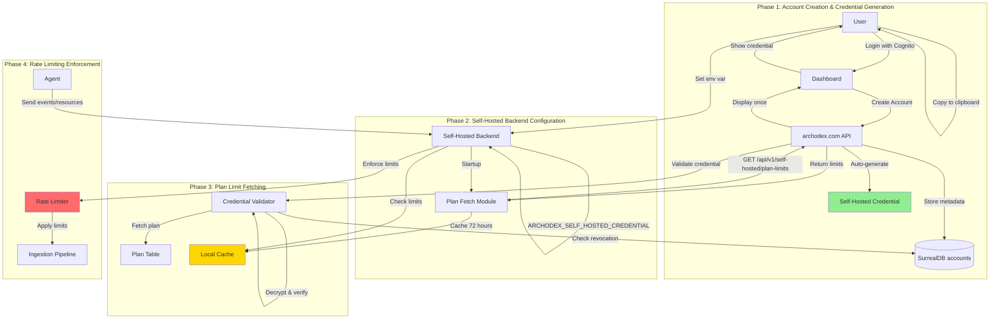

---

## 2. Credential Structure Deep Dive

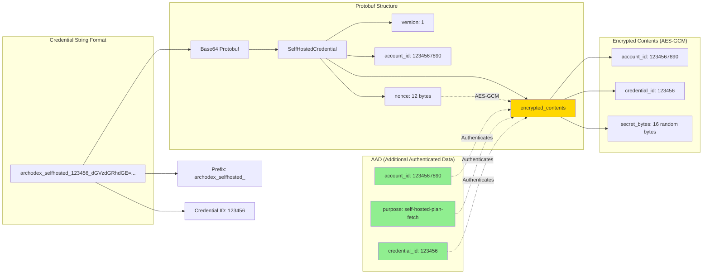

---

## 3. Multi-Backend Support

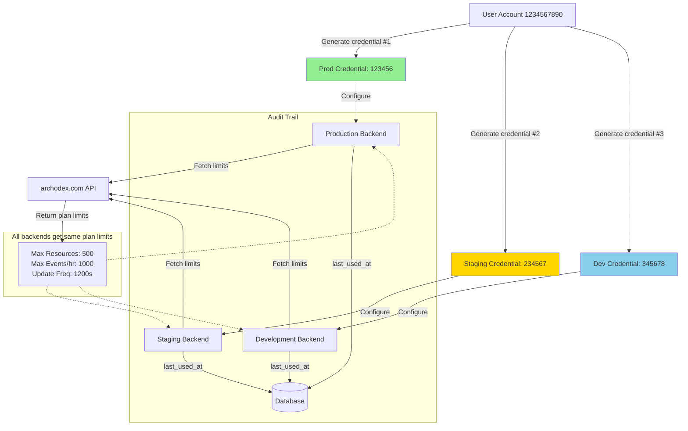

---

## 4. Credential Validation Flow

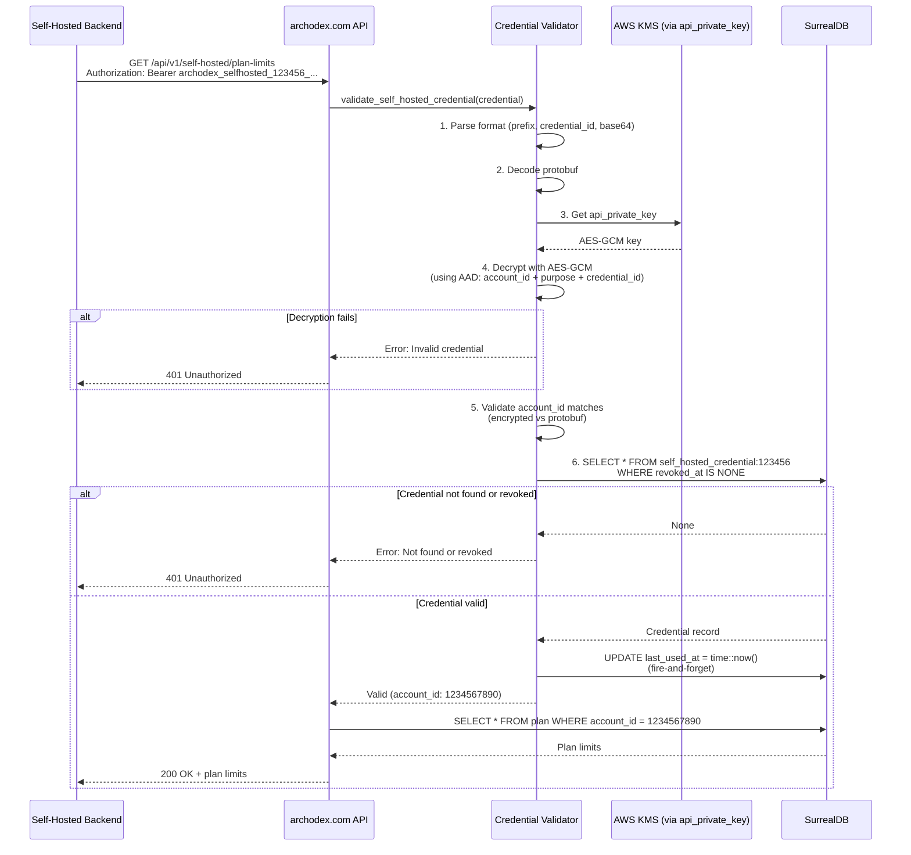

---

## 5. Credential Lifecycle Management

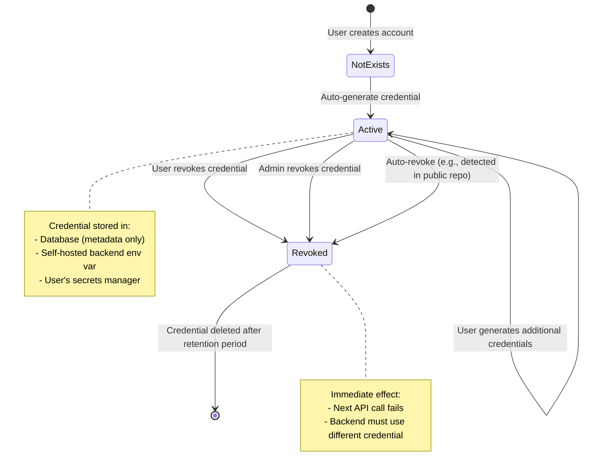

---

## 6. Security Model Comparison

### Option 1: Auto-Generate (Basic)

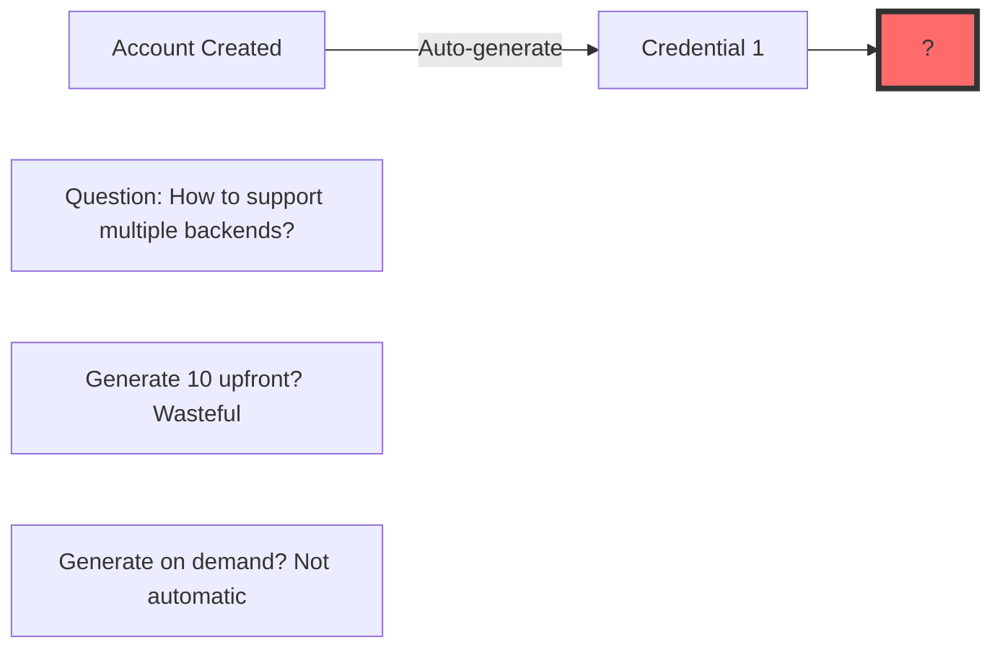

### Option 2: Backend Self-Registration

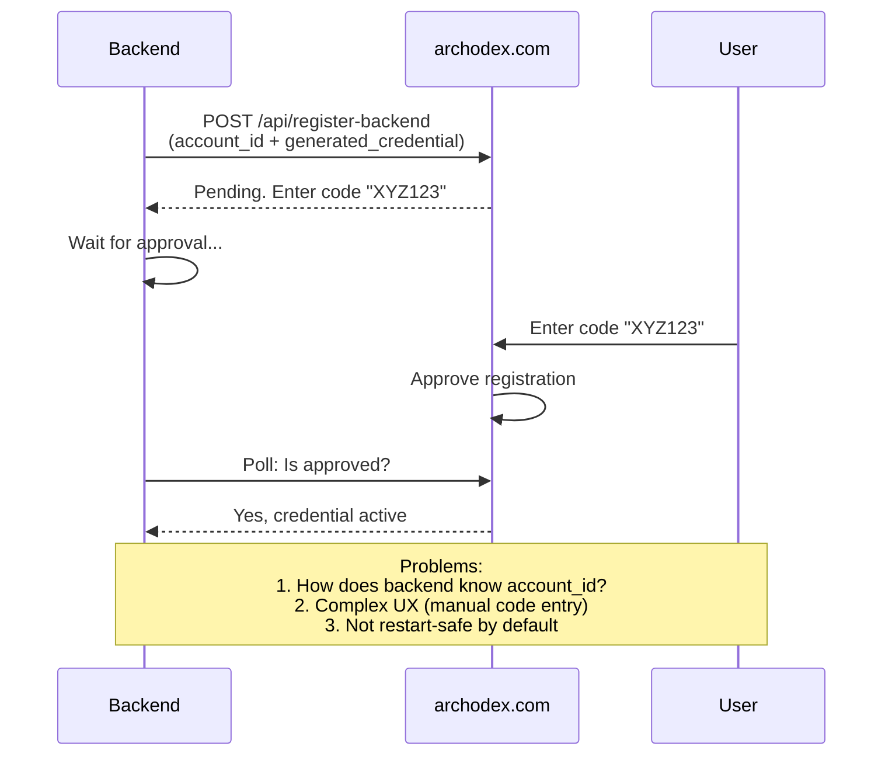

### Option 3 Enhanced: Shared Secret with AES-GCM (RECOMMENDED)

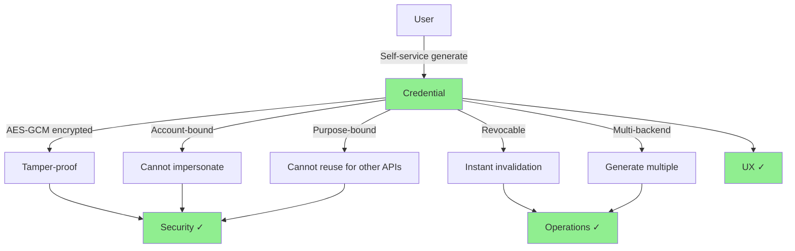

---

## 7. Abuse Detection & Mitigation

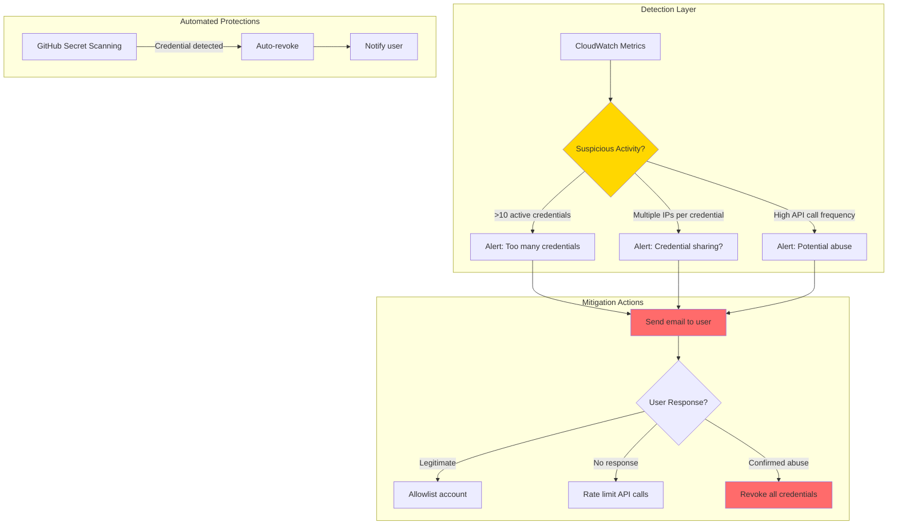

---

## 8. Implementation Phases

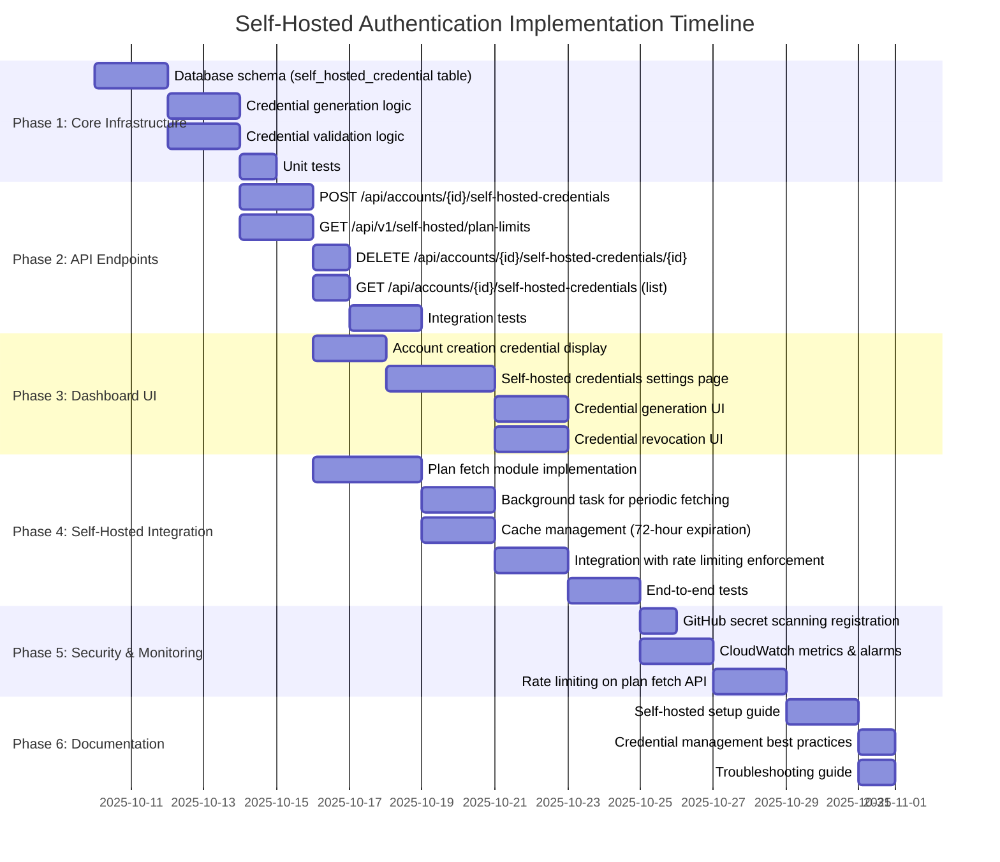

---

## 9. Comparison Matrix

| Feature | Option 1: Auto-Gen Basic | Option 2: Self-Reg | Option 3: Shared Secret Basic | Option 3 Enhanced (RECOMMENDED) |
|---------|--------------------------|-------------------|------------------------------|--------------------------------|
| **Self-service** | ⚠️ Partial (unclear multi-backend) | ✅ Yes | ✅ Yes | ✅ Yes |
| **Multi-backend** | ❌ Unclear | ✅ Yes (complex UX) | ⚠️ Yes (same credential) | ✅ Yes (multiple credentials) |
| **Restart-safe** | ✅ Yes | ⚠️ Needs persistence | ✅ Yes | ✅ Yes |
| **Abuse-tolerant** | ✅ Yes | ⚠️ Risk of spam | ❌ All-or-nothing | ✅ Yes (detection possible) |
| **Security** | ⚠️ Basic | ⚠️ Complex flow | ❌ No tamper protection | ✅ AES-GCM tamper-proof |
| **Audit trail** | ❌ No | ✅ Yes | ❌ No | ✅ Yes (credential_id + last_used_at) |
| **Granular revocation** | ❌ No | ✅ Yes | ❌ No (all-or-nothing) | ✅ Yes |
| **Implementation complexity** | ⭐ Simple | ⭐⭐⭐⭐ Complex | ⭐⭐ Moderate | ⭐⭐⭐ Moderate-High |
| **Operational complexity** | ⭐⭐ Moderate | ⭐⭐⭐⭐⭐ Very Complex | ⭐ Simple | ⭐⭐ Moderate |
| **Aligns with existing patterns** | ⚠️ Partial | ❌ No | ❌ No | ✅ Yes (report API keys) |

**Legend**:
- ✅ Fully supported
- ⚠️ Partially supported or has caveats
- ❌ Not supported or has significant issues
- ⭐ Rating (more stars = more complex)

---

## 10. Threat Model Visualization

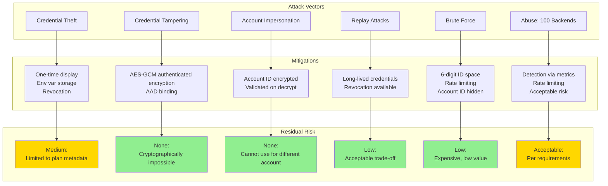

---

## Summary

These diagrams illustrate the complete self-hosted authentication system design, showing:

1. **End-to-end flow** from account creation to rate limiting enforcement
2. **Credential structure** with AES-GCM encryption and AAD
3. **Multi-backend support** with independent credentials
4. **Validation flow** with security checks and revocation
5. **Lifecycle management** from creation to revocation
6. **Security comparison** across all options
7. **Abuse detection** and mitigation strategies
8. **Implementation timeline** across 6 phases
9. **Feature comparison matrix** for all options
10. **Threat model** with mitigations and residual risks

The **Enhanced Shared Secret with AES-GCM (Option 3 Enhanced)** provides the best balance of security, usability, and operational simplicity for self-hosted Archodex backends.
